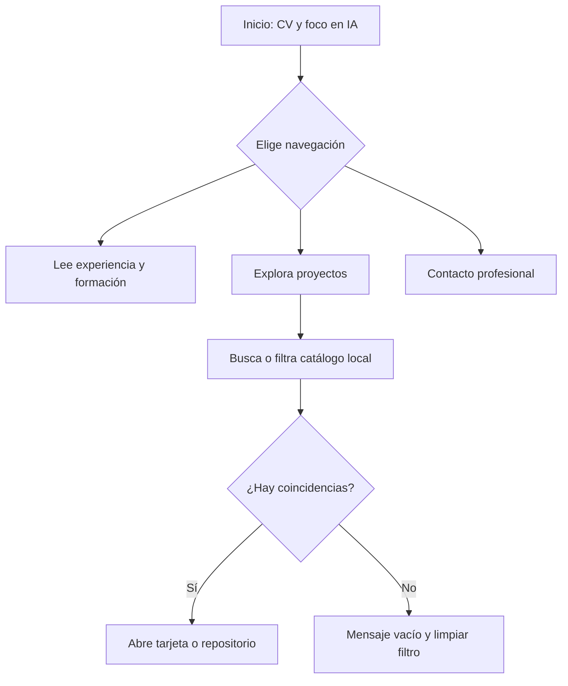
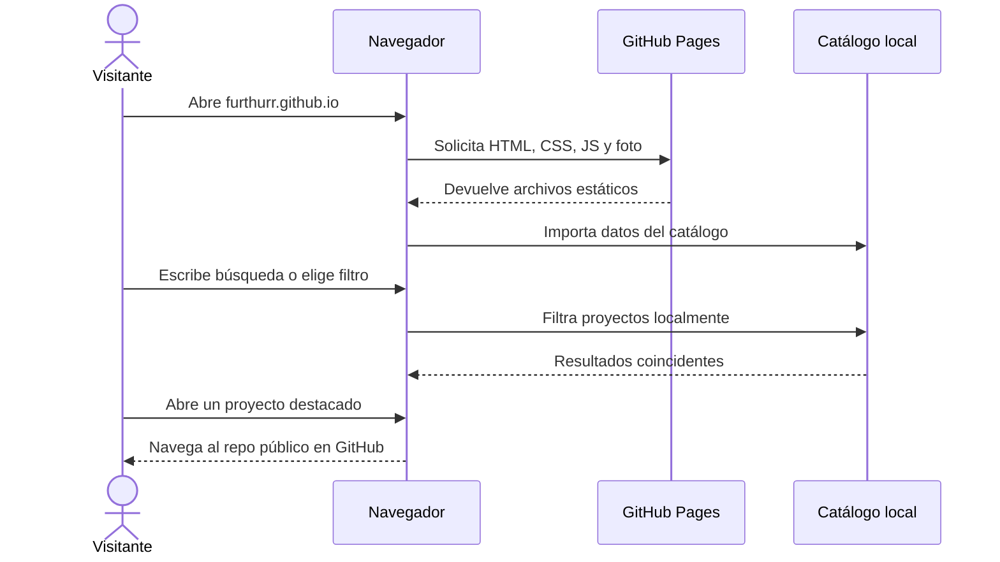

# Diseño — Portafolio profesional

Modo SDD: standard

Fase: Design

Estado: aprobado

Gate 1: aprobado

Gate 2: aprobado por el usuario el 2026-10-02
Fecha: 2026-10-02

## Contexto y supuestos

- Proyecto nuevo, sin stack existente ni UI que preservar. La carpeta contiene la foto suministrada `pedro.png` y los artefactos SDD.
- Sitio personal estático en `furthurr/furthurr.github.io`, servido desde `https://furthurr.github.io/`.
- El CV abre la experiencia y la especialidad de IA aplicada al desarrollo. Los proyectos públicos ilustran herramientas propias, no se atribuyen al empleo de Banco Azteca.
- Se mostrarán formación, los siete empleos del CV, competencias respaldadas y proyectos públicos; se omiten fecha de nacimiento, estado civil, domicilio detallado y teléfono antiguo.
- Banco Azteca: líder técnico, septiembre de 2022–actualidad; las responsabilidades se redactan desde lo indicado por el usuario.
- La UI se escribirá en español. Se usan nombres de tecnologías y el término técnico *skills* donde resulte natural.

## Arquitectura y límites

Sitio estático de una sola página, sin servidor de aplicación, base de datos, API de GitHub en tiempo de ejecución, telemetría ni dependencias de CDN.

1. `index.html`: estructura semántica, encabezado, CV, catálogo, contacto y metadatos.
2. `styles.css`: tokens CSS, layout fluido, temas claro/oscuro según preferencia del sistema, impresión y movimiento reducido.
3. `projects.js`: catálogo estático revisado de los 24 repositorios públicos y función pura de búsqueda/filtrado.
4. `app.js`: navegación del catálogo, filtros, estados vacíos y enlaces externos.
5. `pedro.png`: foto proporcionada, reutilizada desde la raíz.
6. `.github/workflows/pages.yml`: validación con Node y publicación de Pages desde `main` usando el flujo oficial de artefacto.
7. `scripts/prepare-pages.js`: copia a `site-dist/` una lista permitida de archivos estáticos para publicar solo el sitio (no pruebas ni documentación interna).
8. `favicon.svg`: icono local con monograma PG para pestañas y marcadores.

El navegador carga contenido estático del mismo origen. Los proyectos se filtran localmente; los enlaces de las tarjetas navegan a GitHub al ser seleccionados. Las capacidades de GitHub no serán necesarias para ver la página.

## Estructura de la experiencia

1. **Navegación:** marca/nombre y anclas CV, Proyectos y Contacto; enlace «Saltar al contenido» para teclado.
2. **CV — primera sección:** retrato, nombre, título «Líder técnico en desarrollo móvil y herramientas de IA para ingeniería de software» y síntesis que presenta agentes especializados, *skills* y automatización como diferenciadores principales.
3. **IA para desarrollo:** bloque destacado con agentes, creación de skills y herramientas de ciclo de vida de software, conectando explícitamente la responsabilidad laboral indicada con evidencia de repositorios personales.
4. **Experiencia:** línea de tiempo cronológica inversa. Banco Azteca es el puesto actual; los empleos previos respetan cargos, fechas y actividades del CV original.
5. **Competencias:** primero agentes, skills y tooling de IA; después bots/automatización, desarrollo móvil y tecnologías web. No se presentan barras de dominio, años de experiencia por lenguaje ni credenciales inventadas.
6. **Formación:** dos títulos del CV original.
7. **Proyectos:** tres destacados inicialmente (`ai-agents-kit`, `Best-Practices-LLM`, `songcraftFurthurr`) y catálogo restante con buscador, filtro por categoría y mensaje de cero resultados. Cada tarjeta muestra descripción verificable, etiquetas técnicas disponibles y enlace al repo. Los forks se señalan como tales.
8. **Contacto:** correo profesional, perfil de GitHub y cierre simple.

La cuadrícula de proyectos usa tarjetas uniformes en lugar de masonry; mantiene lectura, orden por teclado y posición estable al filtrar. El listado y las tarjetas existen en español, con nombres de proyectos originales.

## Dirección visual y componentes

- **Estilo:** editorial de ingeniería, de alto contraste y centrado en lectura; referencias sutiles a una bitácora técnica, sin estética cliché de “IA” basada en degradados morados/rosas ni decoración ornamental.
- **Composición:** ancho de lectura acotado, encabezado de CV con retrato y título en dos columnas en escritorio; una columna en móvil. Timeline legible y cuadrícula de dos/tres columnas según ancho.
- **Color claro:** fondo `#F8FAFC`, superficies `#FFFFFF`, texto principal `#0F172A`, texto secundario `#334155`, acento/acciones `#0369A1`, bordes `#E2E8F0`, acento suave `#E0F2FE`.
- **Color oscuro:** fondo `#020617`, superficies `#0F172A`, texto principal `#F8FAFC`, texto secundario `#CBD5E1`, acento `#38BDF8`, bordes `#334155`.
- **Tipografía:** stack de sistema sans-serif para lectura e interfaz, con monospace de sistema solo para etiquetas de tecnología/metadata; no se requiere descarga de fuentes.
- **Ritmo y forma:** escala de espaciado basada en múltiplos de 4 px; contenedor de 72 rem, espacio lateral fluido, bordes finos, radios entre 0.5 y 1 rem, elevación mínima y sin desplazamientos de layout al pasar el cursor.
- **Componentes:** navegación, botón/enlace CTA, bloque de titular, retrato, timeline laboral, grupo de competencias, tarjeta de proyecto, buscador, chips de filtro, estado vacío y footer de contacto. Estados hover, focus, active y vacío claramente diferenciados. Íconos SVG lineales de una sola familia; no se usan emojis como controles.
- **Accesibilidad:** landmarks y jerarquía de headings, contraste WCAG AA como mínimo, foco visible, controles táctiles de al menos 44 × 44 px, etiquetas accesibles para búsqueda/filtros y `aria-live="polite"` para resultados. Evitar depender solo del color.
- **Tema:** respetar `prefers-color-scheme` automáticamente; no añadir un control de tema independiente.
- **Impresión:** ocultar navegación y filtros, usar fondo blanco/tinta, preservar secuencia CV y enlaces de contacto, evitar cortes dentro de entradas laborales.

## Modelo local de contenido

`Project` contiene: `name`, `url`, `description`, `category`, `technologies[]`, `isFork` y `featured`. Los valores son estáticos, derivados de metadatos/README revisados y pueden editarse sin GitHub API. La biografía, empleos y educación se marcan directamente en HTML para que el CV sea el contenido principal indexable.

Categorías iniciales: IA y tooling; automatización y bots; web y escritorio; móvil; documentación y aprendizaje; extensiones y utilidades. Cada proyecto tendrá una categoría principal para que el filtrado sea predecible. Las tecnologías omitidas en fuente no se adivinan.

La renderización asigna texto con `textContent` y valida/usa solo enlaces HTTPS a repositorios de `github.com/furthurr/`. Las tarjetas no dependen de capturas que falten o demos cuya disponibilidad no esté comprobada.

## Errores y degradación

- El catálogo está empaquetado localmente; la indisponibilidad de GitHub no impide cargar, buscar o leer los proyectos.
- Si el módulo de proyectos falla al cargar, una región visible `role="alert"` ofrece el acceso al perfil general de GitHub y conserva el CV y los datos de contacto.
- La búsqueda sin coincidencias informa que no hubo resultados y ofrece limpiar búsqueda/filtro.
- La foto tiene texto alternativo; ante fallo del archivo se conserva el nombre y el layout no colapsa.
- Si JavaScript está deshabilitado, el CV, navegación por anclas y selección de proyectos destacados permanecen disponibles; un texto explica que búsqueda/filtros requieren JavaScript.
- Error del despliegue: GitHub Actions debe fallar con el comando que no pasó y no publicar artefacto inválido.

## Requisitos no funcionales (RNF)

- **RNF-1 Rendimiento/autonomía:** la experiencia principal no dependerá de una API/CDN; HTML, CSS, JS, retrato y datos se servirán desde el mismo origen.
- **RNF-2 Responsividad:** sin desplazamiento horizontal en viewports de 360, 768 y 1440 px; probar además un teléfono de 375 px y escritorio amplio.
- **RNF-3 Accesibilidad:** operación por teclado completa, estado focus distinguible, semántica verificable y preferencia de movimiento reducido respetada.
- **RNF-4 Privacidad:** sin analítica ni envío de búsquedas o información personal a servicios externos. Un enlace externo solo se abre si el visitante lo elige.
- **RNF-5 Impresión:** el diálogo nativo de impresión genera un CV legible, sin navegación ni controles de filtrado.

## Estrategia de pruebas

- **Nivel:** TDD focalizado para búsqueda y filtro de categorías del catálogo; tests de ejemplo con `node:test` sobre funciones puras, sin librerías adicionales.
- **RED/GREEN:** cubrir coincidencias por nombre/descripción/tecnología, combinación búsqueda+categoría, fork y lista vacía; después integrar el render y estado accesible.
- **Verificación manual:** validar en navegador el flujo de anchors, filtros/teclado, impresión, tema del sistema y vistas de 360/768/1440 px. Spot-check visual y de contraste/foco.
- **CI:** correr el test nativo de Node y comprobaciones estáticas mínimas; solo publicar Pages si la validación termina correctamente.
- **Sin PBT:** los filtros no requieren propiedades algebraicas adicionales para este catálogo acotado.

## Invariantes críticos

1. El CV antecede visualmente al catálogo y el bloque principal da prominencia a IA, agentes y skills.
2. La fecha de Banco Azteca es septiembre de 2022–actualidad y las responsabilidades coinciden con lo confirmado por el usuario.
3. Cada tarjeta corresponde a un repositorio público verificado; un fork está etiquetado y no se atribuye como original.
4. Filtrar no modifica el contenido de la fuente ni genera HTML a partir de texto no confiable.
5. El sitio conserva contenido esencial y contacto aunque no cargue JavaScript o GitHub.

## Excepciones al quality-bar

- Sin base de datos/servidor/API: sitio de contenido estático sin estado persistente ni IO de aplicación.
- Sin framework o DI: una composición pequeña de módulos ESM es suficiente; no hay servicios externos por inyectar.
- Sin logging backend: un error de módulo se presenta al usuario y el paso de CI muestra la causa.
- Sin PBT: no hay invariante algebraico que justifique una librería/property suite.

## Diagramas

## Documentación visual

El usuario autorizó el sistema compacto completo en `.design/` y lo aprobó en Gate 2. Sus tokens se implementaron en `styles.css`, se contrastaron con los tokens reales y el registro visual se revisó en navegador.

## Gate 2

Aprobado por el usuario el 2026-10-02. La implementación y publicación se completaron conforme a `tasks.md`; la verificación final y el Gate 4 están en `verification.md`.
