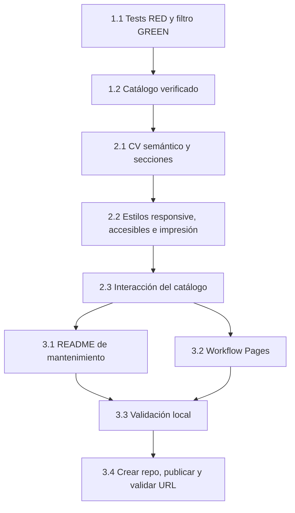

# Tareas — Portafolio profesional

Modo SDD: standard

Fase: Tasks

Estado: en progreso

Gate 1: aprobado

Gate 2: aprobado

Gate 3: aprobado por el usuario el 2026-10-02
Fecha: 2026-10-02

## Wave 1 — Catálogo y comportamiento verificable

- [x] **1.1 [TDD focalizado]** Crear `package.json` para ESM/tests nativos y `tests/projects.test.js`; observar RED para coincidencias, filtros combinados y estado vacío; implementar `filterProjects` en `projects.js`, observar GREEN y refactorizar si reduce complejidad (Req R2.5, R2.6).
- [x] **1.2** Incorporar los 24 repositorios verificados a `projects.js`, con nombre, URL HTTPS, síntesis, categoría, tecnologías confirmadas, flag de fork y proyectos IA destacados; revisar cada ficha contra `sources.md` (Req R2.2, R2.3, R2.4, R2.7, R2.9).

## Wave 2 — Experiencia CV, proyectos y estilos

- [x] **2.1** Implementar `index.html` con CV inicial, titular centrado en agentes/skills, fotografía, responsabilidades actuales confirmadas, línea de tiempo previa, formación, competencias priorizadas, proyectos destacados, contacto, metadatos y fallback sin JavaScript (Req R1.1–R1.7, R1.3a, R1.3b, R1.9, R1.10, R2.1, R2.7, R3.1, R3.2, R3.5, R4.5).
- [x] **2.2** Implementar tokens CSS y componentes responsive; cubrir tema del sistema, foco visible, targets táctiles, movimiento reducido y estilo de impresión; mantener `.design/` sincronizado con los valores aplicados (Req R1.8, R3.3, R3.5, R3.6; RNF-1–RNF-5).
- [x] **2.3** Implementar `app.js`: renderizar catálogo con DOM seguro, búsqueda y filtros accesibles, estado `aria-live`, recuperación desde el estado vacío y mensaje alternativo ante error de módulos; mantener búsqueda/proyectos locales sin consulta de red (Req R2.1, R2.5, R2.6, R2.8, R2.9, R3.4, R4.3).

## Wave 3 — Operación y publicación

- [x] **3.1** Añadir `README.md` con desarrollo local, ejecución de tests, actualización de CV/proyectos y pasos de mantenimiento (Req R4.4).
- [x] **3.2** Configurar `scripts/prepare-pages.js` para copiar una lista permitida de archivos a `site-dist/` y `.github/workflows/pages.yml` para correr tests antes de publicar el artefacto; usar permisos mínimos y el flujo de GitHub Pages desde `main` (Req R4.1, R4.2, R4.6).
- [x] **3.3** Ejecutar validación local: tests, comprobación de sintaxis/enlaces, flujos de teclado y búsqueda; verificar render a 360/768/1440 px, impresión, temas, movimiento reducido y fotografía; cerrar hallazgos visuales comprobables en `.design/ui-tech-debt.md` (Req R1.8, R2.1–R2.9, R3.3–R3.6, R4.3; RNF-1–RNF-5).
- [🔵] **3.4** Inicializar Git con rama `main`, crear repositorio público `furthurr/furthurr.github.io` mediante GitHub CLI, publicar el código validado, activar GitHub Pages con Actions y comprobar workflow y URL pública (Req R4.1–R4.3, R4.6).

## Dependencias y waves

## Gate 3

Aprobado por el usuario el 2026-10-02. La publicación en `furthurr/furthurr.github.io` forma parte de la solicitud original y se ejecutará después de validar el sitio.
